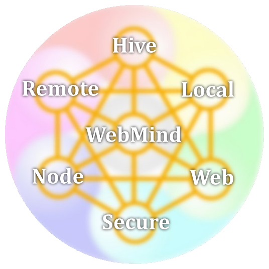

# WebMind 2.0 Architecture

 

## System components

These classes are basically the various system components that can be instantiated in the WebMind framework.
They are described below.

### Node

Node is mainly a local program capable of processing data on the same system. Its data is all local, it 
only has a web interface to be able to control it from outside. If the IP address is 0.0.0.0, it can be accessed 
by any system, but using a local IP like for instance 192.168.2.111 will force the user of the web interface 
to use its exact address. 

### Web

Web is a set of Nodes, which can work together to get things done. They may divide the work, but still have no 
guaranteed redundancy. If a node drops it may be restarted by peers, but the peer list is fixed, and does not 
accept new entries. 

### Hive

## Process components

### Local

Local processes information, all by itself. If it fails, no restart is possible automatically. 

### Remote

### Secure

